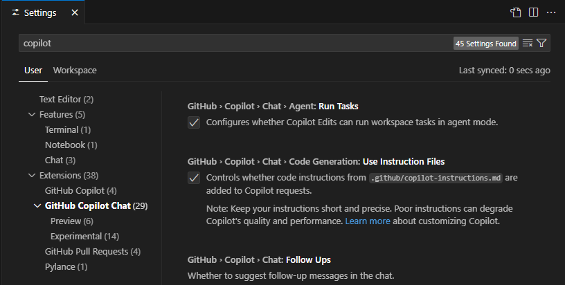
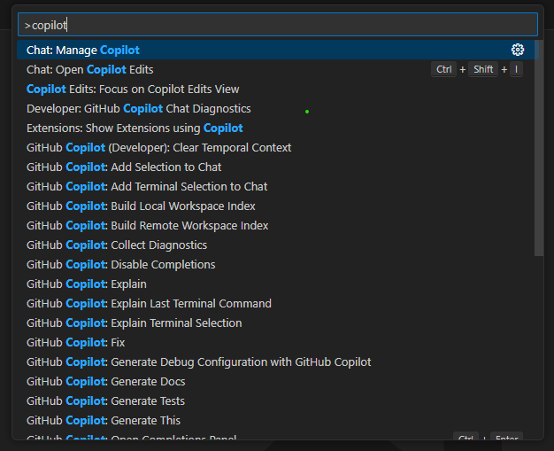
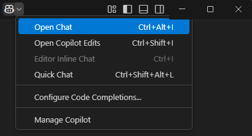
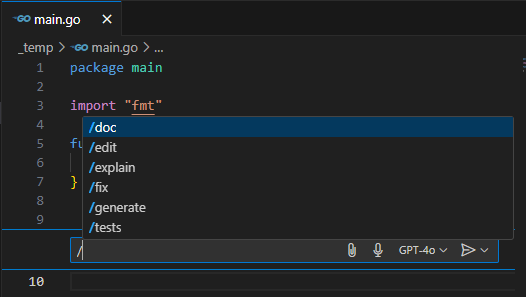
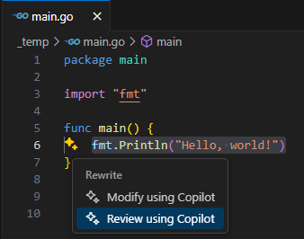

# github-copilot-gui-install

## main

- https://github.com/features/copilot
- https://copilot.github.com/

## install

- Visual Studio Code
  - https://code.visualstudio.com/
- Visual Studio Code Extension - Copilot
  - https://marketplace.visualstudio.com/items?itemName=GitHub.copilot
- Visual Studio Code Extension - Copilot Chat
  - https://marketplace.visualstudio.com/items?itemName=GitHub.copilot-chat
- Visual Studio Code Extension - Github Copilot for Azure
  - https://marketplace.visualstudio.com/items?itemName=ms-azuretools.vscode-azure-github-copilot

## configure

- On the "file" menu select "Preferences" then "Settings", in "Search Settings" type  "copilot",
  - 

## use

### command palette

- Windows or Linux
  - Ctrl + Shift + P
- Mac
  - Cmd + Shift + P
- Both
  - Enter "copilot" to see available commands,
    - 

### copilot chat

- Open the Copilot chat panel in your IDE,
  - 

### inline chat

- Place your cursor where you want assistance,
  - Windows or Linux
    - Ctrl + I
  - Mac
    - Cmd + I
- Use [/slash commands](gh-cli-copilot-cheatsheet.md#slash-commands) or ask questions or request changes specific to that code location,
  - 
- Select a specific code location and select the 2 yellow stars for options,
  - 
